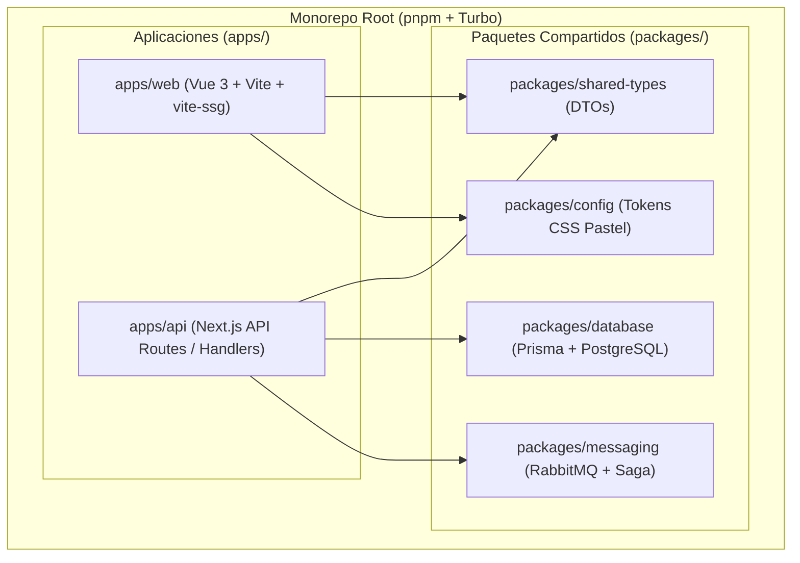

# Diseño de Arquitectura Monorepo — Monchis Café

## 1. Visión General del Sistema

**Monchis Café** adopta una arquitectura de **Monorepo** administrada mediante `pnpm workspaces` y `Turborepo`, desacoplando responsabilidades entre la capa de interfaz pública / POS (`apps/web`) y la capa de servicios backend (`apps/api`), compartiendo esquemas de base de datos, tipados y utilidades de mensajería asíncrona.

---

## 2. Componentes y Responsabilidades

### 2.1 `apps/web` (Frontend Vue 3 SPA + `vite-ssg`)
* **Tecnología:** Vue 3, Vite, Pinia, Vue Router.
* **SEO con `vite-ssg`:** Rutas públicas (`/`, `/nosotros`, `/menu`, `/contacto`) prerenderizadas en tiempo de compilación para garantizar que los motores de búsqueda indexen contenido completo.
* **Rutas Privadas:** `/pos` y `/admin/*` estructuradas como Single Page Application con protección anti-rastreo (`noindex, nofollow`).

### 2.2 `apps/api` (Backend Next.js REST API Stateless)
* **Tecnología:** Next.js Route Handlers en Node.js.
* **Autenticación Stateless:** Verificación de Access Token JWT en memoria y Refresh Token rotativo en cookie `httpOnly`.
* **Seguridad:** Middleware de validación con Zod, sanitización de inputs y validación de tokens de **Google reCAPTCHA v2/v3**.

### 2.3 `packages/database` (Prisma ORM)
* **Base de Datos:** PostgreSQL 15 (`cafeteria_db`).
* **Modelos:** Usuarios, Roles, Productos (Orgánicos/Comerciales), Lotes de Trazabilidad, Ventas, Pagos, Atribución de Tráfico y Auditoría de Sagas.

### 2.4 `packages/messaging` (RabbitMQ + Patrón Saga + DLQ)
* **Broker:** RabbitMQ con Topic Exchange `cafeteria.events`.
* **Transacciones Distribuidas:** Orquestador Saga para ejecutar transacciones compensatorias automáticas (reversas) ante rotura de stock.
* **Dead Letter Queue (DLQ):** Colas de reintento progresivo (10s, 60s, 300s) y desvío a DLQ con alerta por correo SMTP.
