# Modelo Entidad-Relación (ERD) — Monchis Café

Este documento formaliza el diseño de la base de datos relacional para **Monchis Café** implementado en PostgreSQL mediante Prisma ORM.

---

## 1. Diagrama Entidad-Relación

```mermaid
erDiagram
    User ||--o{ Order : "realiza (como cliente)"
    User ||--o{ Order : "atiende (como cajero)"
    User ||--o{ Attribution : "registra origen"
    
    Product ||--o{ Batch : "contiene lotes trazables"
    Product ||--o{ OrderItem : "incluido en"
    
    Order ||--|{ OrderItem : "contiene"
    Order ||--o{ Attribution : "asociado a campaña"
    Order ||--o{ SagaStateLog : "auditoría de saga"

    User {
        string id PK
        string email UK
        string passwordHash
        string nombre
        enum rol "ADMIN | CAJERO | CLIENTE"
        boolean dosFactoresActivo
        string dosFactoresSecret
        int puntosFidelidad
        int sellosAcumulados
        datetime createdAt
        datetime updatedAt
    }

    Product {
        string id PK
        string nombre
        string descripcion
        enum tipo "ORGANICO | COMERCIAL"
        decimal precio
        int stockActual
        int stockMinimo
        string imagenUrl
        boolean activo
        datetime createdAt
        datetime updatedAt
    }

    Batch {
        string id PK
        string productoId FK
        string numeroLote UK
        string proveedorRegional
        string fincaOrigen
        datetime fechaCosechaTostado
        datetime fechaCaducidad
        decimal cantidadKilos
        string alertasSanitarias
        datetime createdAt
        datetime updatedAt
    }

    Order {
        string id PK
        decimal total
        decimal descuento
        enum metodoPago "EFECTIVO | TARJETA | TRANSFERENCIA | PUNTOS | MIXTO"
        string referenciaPago
        enum estado "PENDIENTE | PROCESANDO | COMPLETADA | CANCELADA_REEMBOLSADA"
        string clienteId FK
        string cajeroId FK
        datetime createdAt
        datetime updatedAt
    }

    OrderItem {
        string id PK
        string orderId FK
        string productoId FK
        int cantidad
        decimal precioUnitario
        decimal subtotal
    }

    Attribution {
        string id PK
        string orderId FK
        string userId FK
        string utmSource "google_maps | instagram | direct"
        string utmMedium
        string utmCampaign
        string ipAddress
        string userAgent
        datetime createdAt
    }

    SagaStateLog {
        string id PK
        string sagaId UK
        string orderId FK
        enum estadoActual
        json eventosEjecutados
        json compensacionesEjecutadas
        string motivoFalla
        datetime createdAt
        datetime updatedAt
    }

    RevokedToken {
        string id PK
        string tokenJti UK
        datetime expiraEn
        string motivo
        datetime createdAt
    }
```

---

## 2. Diccionario de Datos y Reglas de Integridad

1. **Trazabilidad Orgánica (`Batch`):** La regla `ON DELETE RESTRICT` previene eliminar productos que tengan lotes con histórico de compras o ventas.
2. **Atribución de Tráfico (`Attribution`):** Captura parámetros `utm_source` en la primera visita para evaluar efectividad de publicaciones de Instagram y ficha de Google Maps.
3. **Auditoría Saga (`SagaStateLog`):** Almacena el historial cronológico de eventos y compensaciones ante fallas distribuidas.
