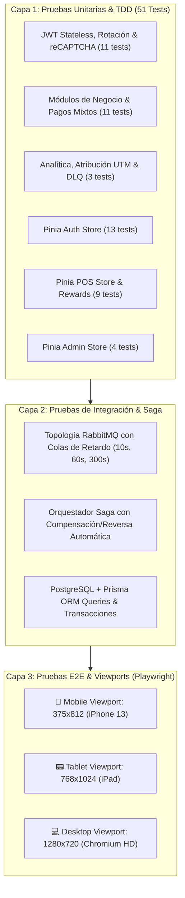

# Reporte y Plan de Pruebas Multicapa — Monchis Café

Este documento detalla la estrategia de aseguramiento de calidad (QA) y pruebas automatizadas multicapa implementadas para el sistema de **Monchis Café**.

---

## 🏗️ 1. Matriz de Pruebas Multicapa

---

## 📱 2. Validación de Viewports y Rendimiento Responsive

| Viewport | Resolución | Enfoque de Prueba | Componentes Auditados |
|---|---|---|---|
| **Mobile** | `375 x 812 px` | Navegación táctil con una sola mano, menú colapsable (hamburguesa). | `AppNavbar`, `LoginPage`, `POSPage` (drawer colapsable). |
| **Tablet** | `768 x 1024 px` | Terminal táctil de mostrador para cajeros en punto de venta. | `POSPage` (grid 2 columnas, panel lateral de cobro). |
| **Desktop** | `1280 x 720+ px` | Panel de control administrativo, visualización de tablas y KPIs. | `AdminPage`, `HomePage`, `batches-card`. |

---

## 🛡️ 3. Checklist de Seguridad Automatizado

- [x] **Cero Credenciales en Código:** Toda la configuración se inyecta por variables de entorno (`.env`).
- [x] **Protección contra Inyecciones:** Consultas parametrizadas mediante Prisma ORM y esquemas estrictos de validación Zod.
- [x] **Protección de Tokens Stateless:** El Access Token JWT se almacena exclusivamente en memoria (evitando robo por ataques XSS en `localStorage`), y el Refresh Token se transporta en cookie segura `httpOnly; SameSite=Strict`.
- [x] **Defensa contra Bots y Fuerza Bruta:** Verificación de Google reCAPTCHA v2/v3 en endpoints de autenticación y transacciones críticas.
- [x] **Integridad de Datos en Pagos:** Validación matemática obligatoria de que la suma de partes en pagos mixtos coincida con el total de la orden.
