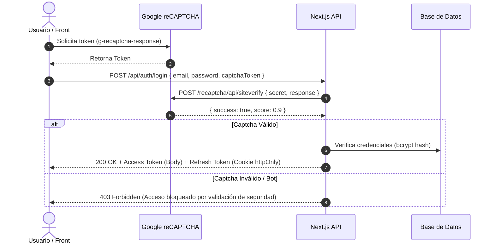

# Especificación Técnica: Autenticación Stateless (JWT) y Google reCAPTCHA

## 1. Arquitectura de Autenticación Stateless

Para maximizar el rendimiento y permitir la escalabilidad horizontal sin sesiones compartidas en servidor:

1. **Access Token:**
   * Formato: JSON Web Token (JWT) firmado con algoritmo `HS256` / `RS256`.
   * Tiempo de Vida: **15 minutos**.
   * Ubicación: Almacenado **únicamente en memoria** en el cliente (Pinia Store).
   * Claims incluidos: `sub` (User ID), `email`, `rol` (`ADMIN`, `CAJERO`, `CLIENTE`).
2. **Refresh Token:**
   * Formato: Token criptográfico aleatorio opaco o JWT firmado de larga duración.
   * Tiempo de Vida: **7 días**.
   * Ubicación: Almacenado en cookie segura `httpOnly; Secure; SameSite=Strict; Path=/api/auth/refresh`.
   * Rotación de Tokens: Cada vez que se usa el Refresh Token, el servidor emite un nuevo par (Access + Refresh) e invalida el anterior.

---

## 2. Integración con Google reCAPTCHA v2 / v3

---

## 3. Checklist de Protección contra Vulnerabilidades (OWASP Top 10)

* [x] **Inyección SQL:** Consultas 100% tipadas y parametrizadas mediante Prisma ORM.
* [x] **XSS:** Validación y sanitización de inputs con Zod; escape nativo en templates de Vue 3.
* [x] **CSRF:** Cookies de Refresh Token configuradas con directiva `SameSite=Strict`.
* [x] **Cabeceras HTTP Seguras:** `Content-Security-Policy`, `X-Content-Type-Options: nosniff`, `X-Frame-Options: DENY`.
