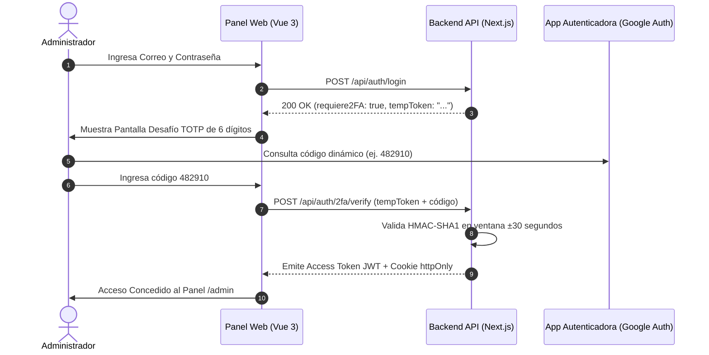

# Monchis Café — Manual del Administrador de la Plataforma

**Versión del Documento:** 1.0.0  
**Fecha de Publicación:** Octubre 2026  
**Audiencia:** Administradores del Sistema, Gerencia Operativa y Encargados de TI  
**Ruta en la Plataforma:** `/admin`

---

## 📋 Tabla de Contenidos
1. [Introducción y Responsabilidades](#1-introducción-y-responsabilidades)
2. [Autenticación Robusta y Doble Factor (2FA / TOTP)](#2-autenticación-robusta-y-doble-factor-2fa--totp)
   - [2.1 Configuración Inicial del 2FA](#21-configuración-inicial-del-2fa)
   - [2.2 Proceso de Desafío en Inicio de Sesión](#22-proceso-de-desafío-en-inicio-de-sesión)
   - [2.3 Desactivación de Seguridad 2FA](#23-desactivación-de-seguridad-2fa)
3. [Panel de Analítica y Control de Marketing](#3-panel-de-analítica-y-control-de-marketing)
   - [3.1 Indicadores Clave de Desempeño (KPIs)](#31-indicadores-clave-de-desempeño-kpis)
   - [3.2 Desglose Financiero: Café Orgánico vs Comercial](#32-desglose-financiero-café-orgánico-vs-comercial)
   - [3.3 Atribución de Tráfico y Campañas UTM](#33-atribución-de-tráfico-y-campañas-utm)
4. [Trazabilidad de Café y Gestión de Lotes](#4-trazabilidad-de-café-y-gestión-de-lotes)
   - [4.1 Registro de Nuevos Lotes Regionales](#41-registro-de-nuevos-lotes-regionales)
   - [4.2 Control de Caducidades y Origen Sanitario](#42-control-de-caducidades-y-origen-sanitario)
5. [Servicio de Alertas por Correo SMTP](#5-servicio-de-alertas-por-correo-smtp)
   - [5.1 Alertas Preventivas y Urgentes de Vencimiento](#51-alertas-preventivas-y-urgentes-de-vencimiento)
   - [5.2 Notificaciones de Stock Mínimo](#52-notificaciones-de-stock-mínimo)
   - [5.3 Alertas Críticas de Dead Letter Queue (DLQ)](#53-alertas-críticas-de-dead-letter-queue-dlq)
6. [Auditoría de Eventos Saga y Dead Letter Queue](#6-auditoría-de-eventos-saga-y-dead-letter-queue)
7. [Exportación de Reportes Financieros (Excel y PDF)](#7-exportación-de-reportes-financieros-excel-y-pdf)

---

## 1. Introducción y Responsabilidades

El panel de administración de **Monchis Café** (`/admin`) es el centro de comando integral para la toma de decisiones comerciales, cumplimiento normativo de alimentos orgánicos, auditoría transaccional y protección cibernética.

El Administrador tiene a su cargo:
- Salvaguardar la seguridad de las cuentas y credenciales.
- Monitorear el inventario de especialidad de productores de Chiapas, Oaxaca y Veracruz.
- Analizar el retorno de inversión (ROI) de los canales de adquisición (Google Maps vs Instagram).
- Revisar fallos de concurrencia y reversas compensatorias del Patrón Saga.

---

## 2. Autenticación Robusta y Doble Factor (2FA / TOTP)

Para cumplir con las directivas de seguridad bancaria y OWASP, la cuenta de administrador exige **Doble Factor de Autenticación (2FA)** basado en tiempo (TOTP - RFC 6238).



---

### 2.1 Configuración Inicial del 2FA
1. Inicie sesión en la plataforma y navegue a `/admin`.
2. En la barra superior, haga clic en el botón de estado de seguridad: **`🛡️ Configurar 2FA (TOTP)`**.
3. Se desplegará el modal interactivo con un código QR generado dinámicamente y la clave secreta alfanumérica en formato Base32.
4. Abra su aplicación autenticadora favorita (**Google Authenticator**, **Microsoft Authenticator** o **Authy**) en su teléfono móvil.
5. Escanee el código QR o ingrese manualmente la clave Base32.
6. Ingrese el código de 6 dígitos generado por la app y presione **Activar Doble Factor**.
7. El sistema confirmará la activación y actualizará el distintivo a **`🛡️ 2FA Activo`** en color verde.

---

### 2.2 Proceso de Desafío en Inicio de Sesión
Una vez activado el 2FA:
1. Al ingresar su correo y contraseña en `/login`, el sistema no otorgará el acceso directamente.
2. La interfaz mostrará la pantalla de desafío: **`🔐 Verificación de Dos Factores (2FA)`**.
3. Introduzca el código temporal de 6 dígitos de su aplicación autenticadora.
4. El sistema validará criptográficamente la marca de tiempo (con tolerancia de ±30 segundos para relojes desfasados) y le concederá acceso al panel.

---

### 2.3 Desactivación de Seguridad 2FA
Si necesita cambiar de dispositivo móvil o desactivar el factor:
1. Abra el panel modal de 2FA desde `/admin`.
2. Introduzca un código válido de 6 dígitos de su aplicación para verificar su identidad.
3. Presione **Desactivar 2FA**. El secreto será removido de forma segura de la base de datos PostgreSQL.

---

## 3. Panel de Analítica y Control de Marketing

El panel extrae métricas en tiempo real directamente de la base de datos relacional y de los eventos transaccionales de venta.

### 3.1 Indicadores Clave de Desempeño (KPIs)
- **Ventas Totales:** Ingreso bruto recaudado en el periodo en moneda nacional ($ MXN).
- **Ticket Promedio:** Gasto medio por cliente en cada compra realizada en mostrador.
- **Órdenes Registradas:** Volumen de transacciones completadas con éxito.
- **Alertas de Caducidad:** Conteo en tiempo real de lotes de café próximos a vencer (< 15 días).

---

### 3.2 Desglose Financiero: Café Orgánico vs Comercial
En cumplimiento del **ODS 12 (Consumo y Producción Responsables)**, el sistema segrega automáticamente las ventas:
- **Café Orgánico de Especialidad:** Monitorea la contribución porcentual y monetaria del café de comercio justo regional.
- **Línea Comercial:** Ventas complementarias de panadería, galletas y bebidas tradicionales.
- Una barra de progreso visual calcula dinámicamente la participación de mercado del café sustentable dentro del negocio.

---

### 3.3 Atribución de Tráfico y Campañas UTM
El sistema captura los parámetros de marketing digital para cuantificar qué canales atraen clientes reales al mostrador físico:

| Canal de Adquisición | Identificador UTM | Tasa de Conversión Promedio | Estrategia de Negocio |
|---|:---:|:---:|---|
| **Google Maps** | `utm_source=google_maps` | ~66.7% | Búsquedas locales de cafeterías cercanas en Maps. |
| **Instagram** | `utm_source=instagram` | ~66.7% | Promociones en reels, historias y fotos de barista. |
| **Tráfico Directo** | Sin parámetros UTM | ~50.0% | Clientes locales recurrentes y vecinos de la zona. |

---

## 4. Trazabilidad de Café y Gestión de Lotes

El módulo de inventario asegura la trazabilidad desde la cooperativa agrícola hasta la taza del consumidor.

### 4.1 Registro de Nuevos Lotes Regionales
Para registrar una nueva remesa recibida en bodega:
1. Diríjase a la sección **Trazabilidad de Café Orgánico** en el panel de administración.
2. Complete los campos del formulario:
   - **Producto Asociado:** Seleccione la variedad (ej. Café de Olla, Cold Brew, Latte).
   - **Número de Lote Único:** Identificador alfanumérico según norma de trazabilidad (ej. `MC-CHP-2026-A1`).
   - **Proveedor Regional:** Nombre de la cooperativa o unión de caficultores (ej. *Cooperativa Café de Altura Chiapas*).
   - **Finca / Rancho de Origen:** Ubicación geográfica (ej. *Finca Santa Rosa, Tapachula*).
   - **Fecha de Cosecha / Tostado:** Fecha de procesamiento artesanal.
   - **Fecha de Caducidad:** Límite máximo de consumo preferente (habitualmente 6 meses).
   - **Cantidad en Kilos:** Peso neto ingresado a bodega.
   - **Certificación Sanitaria:** Folio o sello de certificación orgánica.
3. Presione **Guardar Lote**. Los datos se persisten en la tabla `Batch` de PostgreSQL.

---

### 4.2 Control de Caducidades y Origen Sanitario
La tabla de lotes clasifica la condición sanitaria en base al tiempo restante de vida útil:
- 🟢 **Óptimo (> 30 días):** Grano fresco en periodo óptimo de consumo.
- 🟡 **Preventivo (6 a 15 días):** Requiere priorizar su uso en barra bajo la política PEPS (Primeras Entradas, Primeras Salidas).
- 🔴 **Urgente (< 5 días):** Grano en riesgo inminente de merma; el sistema despacha alertas automáticas por correo.

---

## 5. Servicio de Alertas por Correo SMTP

El módulo `EmailService` escanea permanentemente el estado del negocio y emite correos HTML formateados a la cuenta del administrador:

```
    [ Escaneo Automático / Cron ] ──▶ Evalúa Lotes, Stock y DLQ ──▶ [ Servidor SMTP ]
                                                                             │
                                                              Despacha correo HTML
                                                              a: admin@monchiscafe.com
```

### 5.1 Alertas Preventivas y Urgentes de Vencimiento
- **Preventiva (<= 15 días):** Asunto: `⚠️ Aviso Preventivo: Lote de Café Orgánico Próximo a Caducar`.
- **Urgente (<= 5 días):** Asunto: `🚨 ALERTA URGENTE: Lote de Café Orgánico por Caducar en Breve`.

### 5.2 Notificaciones de Stock Mínimo
- Cuando el stock físico de un producto en mostrador desciende por debajo del umbral de seguridad (`stockMinimo`), se despacha una alerta para solicitar reabastecimiento antes de agotar existencia.

### 5.3 Alertas Críticas de Dead Letter Queue (DLQ)
- Si una orden de venta en el POS falla de forma recurrente y debe ser compensada o derivada a la cola de mensajes muertos (DLQ), el administrador recibe una notificación inmediata con el identificador de la orden, los reintentos ejecutados y el motivo técnico del fallo.

> [!TIP]
> En la barra de herramientas del panel administrativo se ubica el botón **`📧 Evaluar Alertas SMTP`**, el cual fuerza una evaluación manual instantánea del catálogo y despacha los correos correspondientes.

---

## 6. Auditoría de Eventos Saga y Dead Letter Queue

Para garantizar la integridad transaccional distribuida, el sistema utiliza el **Patrón Saga** con RabbitMQ:
1. Cuando un cajero procesa una venta, el backend emite un evento transaccional.
2. Si los insumos de café orgánico en bodega no satisfacen la orden, el orquestador Saga activa la **Transacción Compensatoria (Reversa)**: cancela la orden, reembolsa el cobro y registra el estado en la tabla `SagaStateLog`.
3. Si ocurren fallos de red persistentes tras 4 reintentos progresivos (10s, 60s, 300s), el mensaje se transfiere a la **Dead Letter Queue (DLQ)**.
4. El administrador puede inspeccionar la tabla **Auditoría de Eventos Saga & DLQ** para auditar el historial de eventos no procesables y proceder a su resolución manual.

---

## 7. Exportación de Reportes Financieros (Excel y PDF)

Para juntas de consejo, declaraciones fiscales o auditorías de sustentabilidad, el panel cuenta con dos modalidades de exportación:

### 7.1 Exportar a Excel (CSV con UTF-8 BOM)
1. En la parte superior derecha del panel, haga clic en **`📊 Exportar a Excel`**.
2. El sistema generará y descargará automáticamente un archivo con el formato:  
   `Reporte_Monchis_Cafe_[FECHA].csv`.
3. **Compatibilidad:** El archivo incluye la firma **UTF-8 BOM**, lo que garantiza que Microsoft Excel en cualquier idioma (incluyendo Windows en español) interprete de manera nativa caracteres con acento, la letra *ñ* y emojis sin requerir asistentes de importación.
4. **Contenido:** Resumen ejecutivo de ventas, ticket promedio, desglose por canal UTM, productos más vendidos y catálogo de lotes con fechas de caducidad.

### 7.2 Exportar a PDF (Reporte Ejecutivo para Impresión)
1. Haga clic en **`📄 Exportar a PDF`**.
2. La plataforma activa el diálogo nativo de impresión del sistema operativo con una hoja de estilo `@media print` optimizada:
   - Se ocultan barras de navegación, botones y controles interactivos.
   - Se formatea la tipografía y los gráficos en alta resolución para hojas tamaño Carta / A4.
3. Seleccione la impresora física de su preferencia o la opción **Guardar como PDF**.
