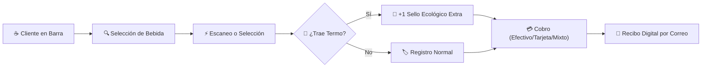

# Monchis Café — Manual de Usuario y Operación de Mostrador (POS)

**Versión del Documento:** 1.0.0  
**Fecha de Publicación:** Octubre 2026  
**Audiencia:** Cajeros de Mostrador, Personal de Barra y Clientes Finales  
**Alineación ODS:** ODS 8 (Trabajo Decente) y ODS 12 (Producción y Consumo Responsables)

---

## 📋 Tabla de Contenidos
1. [Introducción y Filosofía del Negocio](#1-introducción-y-filosofía-del-negocio)
2. [Acceso al Sistema y Roles](#2-acceso-al-sistema-y-roles)
3. [Operación del Punto de Venta (POS)](#3-operación-del-punto-de-venta-pos)
   - [3.1 Interfaz de Usuario y Catálogo](#31-interfaz-de-usuario-y-catálogo)
   - [3.2 Uso del Lector de Código de Barras USB/HID](#32-uso-del-lector-de-código-de-barras-usbhid)
   - [3.3 Atajos de Teclado de Alto Rendimiento](#33-atajos-de-teclado-de-alto-rendimiento)
   - [3.4 Gestión del Carrito de Compra](#34-gestión-del-carrito-de-compra)
4. [Métodos de Pago y Validación](#4-métodos-de-pago-y-validación)
   - [4.1 Efectivo y Cálculo de Cambio](#41-efectivo-y-cálculo-de-cambio)
   - [4.2 Terminal Bancaria y Tarjetas](#42-terminal-bancaria-y-tarjetas)
   - [4.3 Transferencia Electrónica / SPEI](#43-transferencia-electrónica--spei)
   - [4.4 Pagos Mixtos](#44-pagos-mixtos)
5. [Programa de Fidelización: Monchis Rewards](#5-programa-de-fidelización-monchis-rewards)
   - [5.1 Sistema de Sellos Digitales (7+1 Gratis)](#51-sistema-de-sellos-digitales-71-gratis)
   - [5.2 Bonificación Ecológica por Termo Reutilizable](#52-bonificación-ecológica-por-termo-reutilizable)
   - [5.3 Puntos Cashback Monchis](#53-puntos-cashback-monchis)
6. [Resolución de Incidentes y Preguntas Frecuentes](#6-resolución-de-incidentes-y-preguntas-frecuentes)

---

## 1. Introducción y Filosofía del Negocio

**Monchis Café** combina la excelencia del café orgánico de especialidad (cultivado por cooperativas campesinas de Chiapas, Oaxaca y Veracruz) con productos comerciales de alta calidad. 

Este manual describe el funcionamiento diario del Punto de Venta (POS) web para garantizar una atención ágil, cobros exactos, acumulación de recompensas y trazabilidad ecológica en cada taza servida.



---

## 2. Acceso al Sistema y Roles

### 2.1 Credenciales de Acceso
Para operar la terminal de mostrador, el cajero debe ingresar desde el navegador web a la dirección local o de producción:
- **URL de Acceso:** `http://localhost:3000/login` o dominio oficial.
- **Correo Electrónico:** Correo institucional asignado (`cajero@monchiscafe.com`).
- **Contraseña:** Clave de seguridad de mínimo 8 caracteres con mayúsculas y símbolos.
- **Protección Anti-Bot:** El sistema valida automáticamente el token de Google reCAPTCHA para evitar ataques de denegación de servicio.

> [!NOTE]
> La sesión del cajero cuenta con renovación automática en segundo plano mediante cookies seguras `httpOnly`. Si se refresca el navegador (F5), la sesión y el carrito activo se mantienen sin desconexiones.

### 2.2 Roles en el Sistema
| Rol | Permisos Principales |
|---|---|
| **CAJERO** | Operación completa del POS, registro de ventas, aplicación de descuentos ecológicos y consulta de menú. |
| **ADMIN** | Todo lo anterior más: analítica de ventas, trazabilidad de lotes, gestión 2FA, auditoría DLQ y exportación de reportes. |
| **CLIENTE** | Consulta de menú público, visualización de tarjeta de lealtad y balance de puntos. |

---

## 3. Operación del Punto de Venta (POS)

El Punto de Venta se ubica en la ruta protegida `/pos` y está diseñado para pantallas táctiles de tabletas, terminales todo-en-uno y monitores de escritorio.

### 3.1 Interfaz de Usuario y Catálogo
La pantalla se divide en dos zonas ergonómicas:
1. **Catálogo de Productos (Panel Izquierdo):**
   - **Filtros por Pestaña:** `☕ Todos`, `🌿 Café Orgánico`, `🥐 Repostería & Otros`.
   - **Barra de Búsqueda Reactiva:** Permite filtrar instantáneamente escribiendo el nombre del producto (ej. *"Olla"*, *"Cold Brew"*, *"Elote"*).
   - **Fichas de Producto:** Muestran precio oficial, tipo de insumo y stock disponible en bodega.
2. **Orden Actual y Cobro (Panel Derecho):**
   - Resumen de productos agregados, cantidades e importes parciales.
   - Panel de beneficios Monchis Rewards (incentivo de termo).
   - Selección de métodos de pago y botón final de cobro.

---

### 3.2 Uso del Lector de Código de Barras USB/HID
El sistema cuenta con un controlador de eventos de hardware que escucha permanentemente los lectores láser o 2D (código de barras o QR). No es necesario hacer clic en ningún campo para escanear.

```
       [ Escáner USB/HID ]  ──── Emite caracteres en < 60 ms ────▶  [ POS Monchis ]
                                                                             │
                                                                   Agrega producto
                                                                   directo al carrito
```

#### Tabla de Códigos de Barras Preconfigurados
| Código de Barras (EAN / Interno) | Producto Asociado | Tipo | Precio Unitario |
|:---:|---|:---:|:---:|
| `7501001` | Café de Olla Orgánico | 🌿 Orgánico | $48.00 MXN |
| `7501002` | Cold Brew de la Sierra | 🌿 Orgánico | $65.00 MXN |
| `7501003` | Latte Lavanda y Miel | 🌿 Orgánico | $72.00 MXN |
| `7501004` | Panqué Artesanal de Elote | 🥐 Comercial | $45.00 MXN |
| `7501005` | Galleta de Avena y Arándanos | 🥐 Comercial | $28.00 MXN |

> [!TIP]
> Al disparar el escáner sobre el producto, el POS emitirá una alerta visual color verde con el texto: `⚡ Producto agregado por código: [Nombre del Producto]`.

---

### 3.3 Atajos de Teclado de Alto Rendimiento
Para horas pico de alta demanda en mostrador, el cajero puede operar el sistema sin usar el ratón:

| Tecla / Atajo | Acción Ejecutada | Descripción |
|:---:|---|---|
| <kbd>F2</kbd> | **Cobrar Venta Inmediata** | Abre la ventana modal de cobro si el carrito tiene productos. |
| <kbd>Escape</kbd> | **Limpiar / Cerrar Modal** | Si la ventana de cobro está abierta, la cierra; si está en la pantalla principal, vacía el carrito. |
| <kbd>+</kbd> / <kbd>-</kbd> | **Ajustar Cantidad** | Incrementa o decrementa la cantidad del producto seleccionado. |

---

### 3.4 Gestión del Carrito de Compra
- **Agregar Producto:** Clic en la tarjeta del producto, clic en el botón `+ Agregar` o escanear su código de barras.
- **Modificar Cantidades:** Utilice los botones `+` y `-` en la fila del producto en el panel derecho.
- **Vaciar Carrito Completo:** Clic en el botón superior `Vaciar` o presionar la tecla <kbd>Escape</kbd>.

---

## 4. Métodos de Pago y Validación

Al hacer clic en el botón **`Cobrar $[Total]`** (o presionar <kbd>F2</kbd>), se despliega el modal interactivo de procesamiento financiero.

### 4.1 Efectivo y Cálculo de Cambio
1. Seleccione la opción **EFECTIVO**.
2. Ingrese el monto entregado por el cliente en el campo *Monto Recibido*.
3. El sistema calcula y muestra inmediatamente en pantalla el **Cambio a Entregar** en color verde brillante.
4. Si el monto entregado es menor al total, el botón de confirmación permanece inactivo.

### 4.2 Terminal Bancaria y Tarjetas
1. Seleccione la opción **TARJETA**.
2. Deslice, inserte o acerque la tarjeta en la terminal física de cobro (PinPad bancario).
3. Una vez aprobada la transacción en la terminal física, presione **Confirmar Cobro**.

### 4.3 Transferencia Electrónica / SPEI
1. Seleccione la opción **TRANSFERENCIA**.
2. Indique al cliente la cuenta CLABE o código QR SPEI del mostrador.
3. Solicite al cliente la **Referencia Bancaria o Clave de Rastreo (6 a 18 dígitos)** y regístrela en el campo correspondiente para conciliación contable.

### 4.4 Pagos Mixtos
Permite liquidar una venta dividiendo el saldo entre múltiples instrumentos (ej. mitad en efectivo y mitad con tarjeta, o saldo de lealtad + efectivo):
- El sistema valida matemáticamente que la suma de los montos parciales coincida exactamente con el total de la orden antes de autorizar la venta.

---

## 5. Programa de Fidelización: Monchis Rewards

El programa está integrado de forma transparente en el Punto de Venta para fomentar la lealtad y el consumo responsable.

### 5.1 Sistema de Sellos Digitales (7+1 Gratis)
- Por cada café o bebida preparada adquirida, el cliente acumula **1 sello digital**.
- Al alcanzar **7 sellos**, el sistema marca automáticamente que el **8vo café es gratis**.
- El cajero puede aplicar la cortesía en la siguiente orden de bebida.

### 5.2 Bonificación Ecológica por Termo Reutilizable (ODS 12)
- En el panel derecho del POS se encuentra la casilla:  
  `☑️ 🌿 Trae termo reusable (+1 sello ecológico)`
- Si el cliente presenta su propio termo o taza para evitar desechables plásticos:
  - Active la casilla con un solo clic.
  - El sistema bonificará **+1 sello extra** al contador del cliente de forma inmediata.

### 5.3 Puntos Cashback Monchis
- Por cada **$10.00 MXN** gastados en productos de grano o repostería, el cliente acumula **1 punto de lealtad**.
- Cada punto equivale a **$1.00 MXN** utilizable como saldo a favor en futuras compras.

---

## 6. Resolución de Incidentes y Preguntas Frecuentes

### ¿Qué hacer si un producto aparece con stock en cero?
El backend bloquea la venta de insumos sin inventario para evitar discrepancias. Si existe café en grano físico en bodega recién recibido, solicite al Administrador registrar el nuevo lote en la sección de Inventario antes de intentar cobrar.

### ¿Qué sucede si la conexión a internet es inestable?
El frontend de Monchis Café cuenta con **catálogo de contingencia en memoria local**. Si el servidor central tarda en responder, el cajero puede seguir visualizando los productos y sus precios oficiales sin bloqueos en la interfaz.

### ¿Cómo recibe el cliente su comprobante de compra?
Al capturar el correo electrónico del cliente durante el cobro, el servicio de notificaciones SMTP despacha automáticamente un comprobante digital con el desglose de productos, número de orden y sellos de lealtad actualizados.
