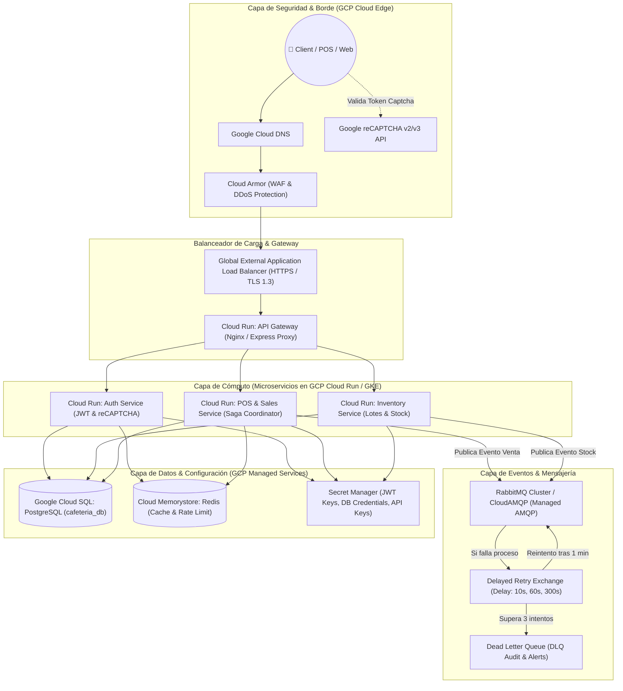
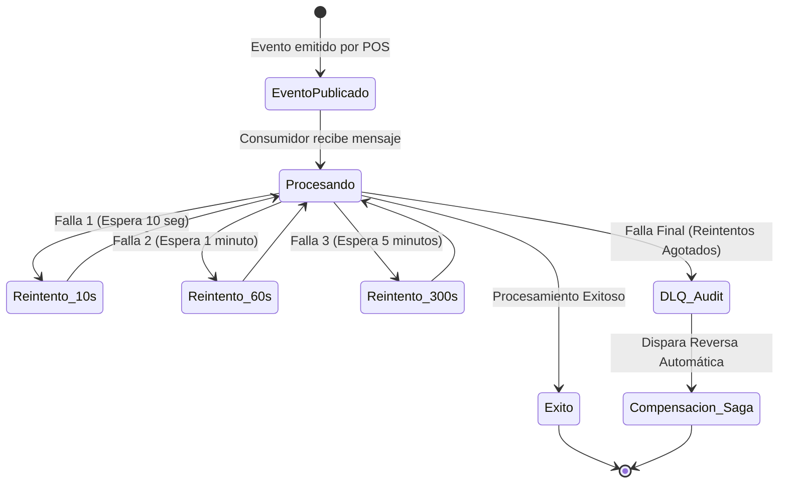
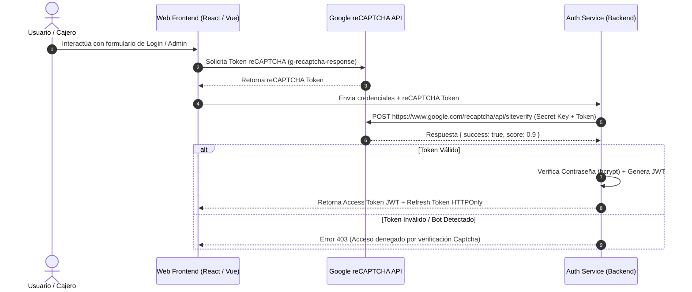

# Plan de Implementación Completo: Arquitectura Cloud, Eventos RabbitMQ, Patrón Saga, Reintentos con Retraso, Google reCAPTCHA e Infraestructura

Este documento expone la propuesta integral de diseño para la **Gestión Web Segura de la Cafetería Orgánica**. Incluye el diagrama de la **Arquitectura en la Nube (GCP)**, la estrategia de **Reintentos Automáticos con Retraso (Delayed Retries)**, la máquina de estados del **Patrón Saga (Reversas)**, la integración de **Google reCAPTCHA** y la infraestructura en Docker.

---

## ☁️ 1. Arquitectura en la Nube (Google Cloud Platform)



---

## 🔄 2. Propuesta Completa del Patrón Saga y Estrategia de Reintentos

### ⏱️ Estrategia de Reintentos Automáticos con Retraso (Delayed Retries)
En lugar de fallar inmediatamente o reintentar en bucle saturando el servidor:
1. **Intento 1 (Inmediato):** El microservicio procesa el evento. Si ocurre un fallo temporal (ej. bloqueo momentáneo en base de datos o microcorte de red), el mensaje no se pierde.
2. **Intento 2 (Retraso de 10 segundos):** Si vuelve a fallar, el mensaje se redirige a la `retry_queue_10s`.
3. **Intento 3 (Retraso de 1 minuto):** Si persiste el fallo, el mensaje pasa a la `retry_queue_60s` (espera 1 minuto para dar tiempo a que los servicios o la red se recuperen).
4. **Intento 4 (Retraso de 5 minutos):** Si aún no se procesa, pasa a `retry_queue_300s`.
5. **Envío a Dead Letter Queue (DLQ):** Si tras el 4to intento (tras más de 6 minutos de reintentos progresivos) el evento no pudo procesarse, el mensaje entra a la `dead_letter_queue` y se activa una alerta en el panel del administrador.



---

### 🛡️ 3. Integración con Google reCAPTCHA v2 / v3



---

## Open Questions

> [!NOTE]
> 1. **Notificación de Alerta DLQ:** Cuando un mensaje caiga en la Dead Letter Queue tras los reintentos automáticos, ¿deseas que el sistema envíe una alerta por correo electrónico mediante el servicio SMTP configurado?

---

## Proposed Changes

### 1. Variables de Entorno y Configuración Base (`.env.example`)

#### [NEW] [.env.example](file:///d:/ernestofm/Proyecto/.env.example)
Plantilla completa con credenciales basadas en `GEMINI`:
- `GOOGLE_CLOUD_PROJECT=gen-lang-client-0573629438`
- `GOOGLE_APPLICATION_CREDENTIALS=./service-account.json`
- `RECAPTCHA_SITE_KEY=your-google-recaptcha-site-key`
- `RECAPTCHA_SECRET_KEY=your-google-recaptcha-secret-key`
- `JWT_ACCESS_SECRET=your-jwt-access-secret-32-chars`
- `JWT_REFRESH_SECRET=your-jwt-refresh-secret-32-chars`
- `JWT_ACCESS_EXPIRES=15m`
- `JWT_REFRESH_EXPIRES=7d`
- `RABBITMQ_HOST=rabbitmq`
- `RABBITMQ_PORT=5672`
- `RABBITMQ_USER=guest`
- `RABBITMQ_PASS=guest`
- `RABBITMQ_RETRY_DELAYS=10000,60000,300000`
- `DB_HOST=postgres`
- `DB_PORT=5432`
- `DB_NAME=cafeteria_db`

---

### 2. Infraestructura (`infra/`)

#### [NEW] [infra/docker-compose.yml](file:///d:/ernestofm/Proyecto/infra/docker-compose.yml)
#### [NEW] [infra/docker/rabbitmq/definitions.json](file:///d:/ernestofm/Proyecto/infra/docker/rabbitmq/definitions.json)
Configuración de RabbitMQ con plugin `rabbitmq_delayed_message_exchange`, colas de retardo y Dead Letter Exchange.
#### [NEW] [infra/docker/api-gateway/Dockerfile](file:///d:/ernestofm/Proyecto/infra/docker/api-gateway/Dockerfile)
#### [NEW] [infra/docker/auth-service/Dockerfile](file:///d:/ernestofm/Proyecto/infra/docker/auth-service/Dockerfile)
#### [NEW] [infra/docker/inventory-service/Dockerfile](file:///d:/ernestofm/Proyecto/infra/docker/inventory-service/Dockerfile)
#### [NEW] [infra/docker/pos-service/Dockerfile](file:///d:/ernestofm/Proyecto/infra/docker/pos-service/Dockerfile)

---

### 3. Código Fuente del Cliente RabbitMQ y Saga (`src/shared/messaging/`)

#### [NEW] [src/shared/messaging/rabbitmqClient.js](file:///d:/ernestofm/Proyecto/src/shared/messaging/rabbitmqClient.js)
Cliente RabbitMQ con soporte de reintentos progresivos (10s, 60s, 300s) y derivación automática a DLQ.

#### [NEW] [src/shared/messaging/sagaOrchestrator.js](file:///d:/ernestofm/Proyecto/src/shared/messaging/sagaOrchestrator.js)
Orquestador Saga para ejecutar transacciones compensatorias (cancelación y reembolso).

#### [NEW] [src/services/auth-service/src/services/captchaService.js](file:///d:/ernestofm/Proyecto/src/services/auth-service/src/services/captchaService.js)
Servicio backend de validación de tokens contra `google.com/recaptcha/api/siteverify`.

---

### 4. Documentación y Memoria en Obsidian

#### [NEW] [docs/tecnica/arquitectura_nube_gcp_microservicios.md](file:///d:/ernestofm/Proyecto/docs/tecnica/arquitectura_nube_gcp_microservicios.md)
#### [NEW] [docs/tecnica/patron_saga_reintentos_dlq.md](file:///d:/ernestofm/Proyecto/docs/tecnica/patron_saga_reintentos_dlq.md)
#### [NEW] [docs/tecnica/seguridad_jwt_recaptcha.md](file:///d:/ernestofm/Proyecto/docs/tecnica/seguridad_jwt_recaptcha.md)
#### [NEW] [obsidian/Arquitectura/Cloud_GCP_Saga_RabbitMQ.md](file:///d:/ernestofm/Proyecto/obsidian/Arquitectura/Cloud_GCP_Saga_RabbitMQ.md)
#### [NEW] [obsidian/Modulos/Autenticacion_JWT_reCAPTCHA.md](file:///d:/ernestofm/Proyecto/obsidian/Modulos/Autenticacion_JWT_reCAPTCHA.md)
#### [NEW] [obsidian/Bitacora/2026-08-23.md](file:///d:/ernestofm/Proyecto/obsidian/Bitacora/2026-08-23.md)
#### [MODIFY] [obsidian/Index.md](file:///d:/ernestofm/Proyecto/obsidian/Index.md)
#### [MODIFY] [obsidian/Arquitectura/Index.md](file:///d:/ernestofm/Proyecto/obsidian/Arquitectura/Index.md)
#### [MODIFY] [obsidian/Modulos/Index.md](file:///d:/ernestofm/Proyecto/obsidian/Modulos/Index.md)
#### [MODIFY] [obsidian/Bitacora/Index.md](file:///d:/ernestofm/Proyecto/obsidian/Bitacora/Index.md)

---

## Verification Plan

### Automated Tests
- Validar archivo docker-compose:
  ```powershell
  docker compose -f infra/docker-compose.yml config
  ```
- Probar lógica de reintentos progresivos con script sintético de RabbitMQ client:
  ```powershell
  node --check src/shared/messaging/rabbitmqClient.js
  node --check src/shared/messaging/sagaOrchestrator.js
  node --check src/services/auth-service/src/services/captchaService.js
  ```

### Manual Verification
- Verificar que las colas de retardo y DLQ aparezcan en el panel `http://localhost:15672`.
- Validar el flujo de verificación de token reCAPTCHA simulando tokens válidos e inválidos.
- Actualizar y revisar la Bitácora de Obsidian `obsidian/Bitacora/2026-08-23.md`.
